# Ecommerce Site - Mini Sew N Sew <!-- omit in toc -->
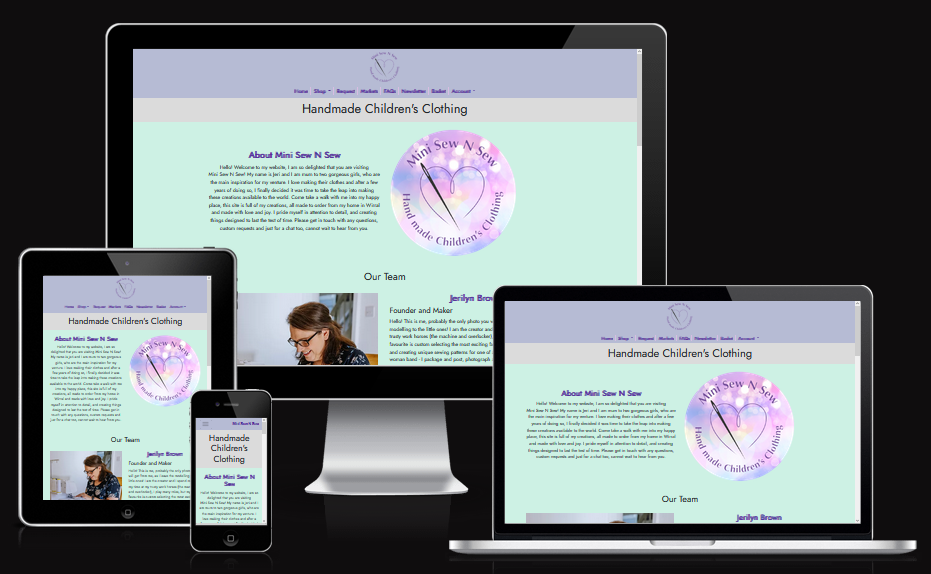  
This project is an e-commerce site allowing the purchase of physical goods.
The site has bee configured to be a store front for my sister's real business - Mini Sew N Sew, as her existing site is lacking many features
she wanted to implement, and is unusable on mobile devices as the site is not responsive.  
This project aims to fix the existing issues she has, by implementing a fully responsive, fully customisable design that she can use and iterate
on in the future to improve her business presence.  
The project can be viewed at the currently deployed instance on Heroku: [Mini Sew N Sew](https://minisewnsew.herokuapp.com/)

# Table of Contents <!-- omit in toc -->
- [Design](#design)
  - [Business Logic and Marketing](#business-logic-and-marketing)
  - [SEO](#seo)
  - [User Stories](#user-stories)
  - [Site Wireframes](#site-wireframes)
- [Features](#features)
  - [Responsive Design](#responsive-design)
    - [Home Page](#home-page)
    - [All Products](#all-products)
    - [Product Details](#product-details)
    - [FAQ Page](#faq-page)
  - [Navigation Bar](#navigation-bar)
  - [Home Page](#home-page-1)
  - [Authentication](#authentication)
  - [FAQ Page](#faq-page-1)
  - [Request a Product](#request-a-product)
  - [Events Page](#events-page)
  - [Product Pages](#product-pages)
  - [Reviews](#reviews)
  - [Shopping Basket](#shopping-basket)
  - [Checkout Page](#checkout-page)
  - [Order Confirmation Page](#order-confirmation-page)
  - [Account Profile Page](#account-profile-page)
  - [Newsletter Signup](#newsletter-signup)
  - [Footer](#footer)
  - [Miscellaneous](#miscellaneous)
- [Testing](#testing)
  - [Validation](#validation)
- [Deployment](#deployment)
  - [Prerequisites](#prerequisites)
  - [To Run The Project Locally:](#to-run-the-project-locally)
  - [To Deploy The Project To Heroku:](#to-deploy-the-project-to-heroku)
- [Known Bugs](#known-bugs)
- [Future Developments](#future-developments)
- [Credits](#credits)

# Design
## Business Logic and Marketing
- What is our business focus?
  - We are a B2C focussed company, selling bespoke hand made children's clothing.
- What do users need?
  - View all our products and get information on them.
  - Purchase our products.
  - Raise requests for custom products.
  - Contact us for help.
  - Get info about the company to increase trustworthiness.
  - A user account, with profile, order history etc.
- How do we meet those needs?
  - Products are viewable by visiting the shop page.
    - Products can be filtered down into categories, to help find the product the user is looking for.
    - Each product has its own standalone details page, with more information etc.
  - The site implements a full ecommerce solution, with typical functionality such as a basket and online checkout process.
  - Customer can raise, view, ammend and delete requests for custom products on a simple to use form.
  - Links to contact the site owners are included in the footer of every page. Additionally the request form can be used if that is the applicable to the nature of their contact.
  - The homepage includes an overview of the company, including images and the company vision.
  - Users can create an account on the site, where orders are saved and can be viewed on subsequent visits.
- How do we make these features easy to use and understand?
  - A navbar at the top of every page ensures a consistent journey around the site, and uses intuitively named pages to improve the user experience.
  - Content is presented in a clear, concise manner, with simple to understand terminology.
  - Colours and styling have been chosen to ensure content is clear and easy to read.
- How do we demonstrate expertise, authoritativeness and trustworthiness in the content?
  - Well written copy, which has been spelling and grammar checked improves the experience for the user.
  - Features such as product reviews allow customers to leave genuine feedback on the products, enhancing trustworthiness for other users.
- How do we help users discover the areas of the site?
  - The intuitively laid out navbar exists on every page of the site, which should encourage users to visit the different pages.
  - If a user visits a non-existent page, a custom 404 error page includes links to the homepage and shop, encouraging them to visit those pages.
  - The site features newsletter signup functionality, encouraging users to come back to the site when new products or features are added.
- What marketing strategies do we implement to increase site visits and purchases?
  - Social media accounts to be used along side the main site to allow us to frequently:
    - Promote specific products.
    - Highlight events / markets we are visiting.
    - Inform people about new products.
    - Post polls / questions about products people would be interested in seeing.
  - Send out a regular newsletter to subscribers with a summary of what's new, and what's upcoming.
  - Mockup of the Facebook business page for the Mini Sew N Sew company:
    - [Facebook Business Page](./docs/assets/marketing/facebook-mockup.png)
## SEO
SEO keyword research to help the site appear high in rankings:
- ### Topics:
  - Handmade
  - Clothing
  - Custom
  - For children
  - Durable
  - Clothing types
- ### Potential keywords / phrases
  - Handmade children's clothing
  - Custom clothing for children
  - Handmade custom clothing
  - Made to order
  - Long lasting
  - Care and attention
  - Lovingly crafted
  - Quality fabrics
  - Clothes
  - Babies / Children
  - Dresses, Dungarees, Jumpers, Leggings, Rompers, Skirts
## User Stories
An agile process was used during the development to track and iterate on user stories for the site, using a GitHub [project](https://github.com/users/SiJiL82/projects/1)  
- As a User, I want to:
  - Browse products the site sells.
  - See details about a specific product.
  - Purchase any products I like.
  - Save my info so I don't have to complete it each time I make a purchase.
  - Get information about the company so I can decide whether to purchase from them or support them in other ways.
  - Request a custom made product.
- As a Site Owner, I want to:
  - Be able to add and remove products.
  - View orders.
  - View requests site visitors have made.
  - Add events I am going to so visitors can also attend.
  - Offer users the ability to sign up to an email newsletter.
  - Provide links to my social media accounts so they can stay up to date with my posts there.

## Site Wireframes
[Design Wireframes](./docs/design_wireframes.md)

# Features
## Responsive Design
The site is fully responsive, with all content and pages resizing to fit mobile, tablet and desktop devices at any resolution.  
Examples:  
### Home Page

### All Products

### Product Details

### FAQ Page

## Navigation Bar
- A navigation bar with links to all areas of the site is present at the top of every page.  

- On smaller devices, the menu compacts down into a single button to reduce space used.  

## Home Page
- The home page for the site contains an overview of the company and its team members.  

## Authentication
- Users can register with the site by selecting the "Sign Up" link on the Accounts tab of the main menu.
- Once registered, they can access areas of the site that are not permitted by unauthenticated users, inluding:
  - "My Account" with their personal details and order history.
  - Place a request for a custom made item.
  - View their existing requests.
- The Site Owner can log in as an administrator, which grants access to the admin areas of the site.
- Within the admin area, the user can:
  - View, add, update and remove products.
  - View, add, update and remove product categories.
  - View orders.
  - View customer requests.
- The administrator account also permits access to front end areas of the site that are not accessible by non-administrators:
  - Create new entries for the Events page
## FAQ Page
- The FAQ page is a simple content page that presents useful information to the user.  

## Request a Product
- Authenticated users will be presented with a form to complete when viewing the requests page.  
- After completing all the fields on the form, it can be submitted and saved to a database for the site owner to view.  
- The user's open requests are listed on the page, and the user can update or delete an existing request.  

## Events Page
- The events page lists all upcoming events that the site owner has created.
- Past events are automatically not shown.  

- The user can click on the map icon next to each event to open a link to Google Maps showing the event location.
- When logged in as an administrator, the site owner can create new events via a front end form, without having to access the admin area of the site.  

- The site administrator also sees a new item on each individual event that allows them to delete an event from the site.  

## Product Pages
- The site features a page to view all products on the site.  

- The shop menu in the nav bar can be expanded to show the different categories of products available on the site, which when clicked will load the same products view, filtered down to that specific category:  
  

- When no products are available for a chosen category, a message is shown to the user directing them to the All Products page:  

- Each product has a "More Details" button that can be clicked to take the user to a product details page for that specific product.
  - On this page the user can see item details, sizes available, and choose to add the item to their shopping basket.  

## Reviews
- Each Product Details page allows users to leave a review for that product via a simple form:  
  
- After a review has been submitted, it shows up under the product.
  - The rating chosen on the review is converted into a star image for easier identification by other users.  

## Shopping Basket
- After adding an item to their basket from the product details page, a banner notification appears letting the user know the action was successful and presenting them with a link to their basket.  

- The basket page shows the user the details on all the products they have added, along with a Grand Total price:  
  
- The user can choose to remove items from their basket by clicking the relevant icon next to each item.  
- If happy with their basket contents, the user can click the "Secure Checkout" button to proceed to checkout.
## Checkout Page
- On the checkout page, the user can enter their contact details, shipping details and credit card information to complete the order.
- If the user is signed in and has made a previous purchase, or has filled in their details on the account page, the contact and shipping details will be pre-populated.  

- Checking "Save this information to my profile" will update the user's profile page with the information entered on this form.
## Order Confirmation Page
- After completing the checkout process, the user is shown the order confirmation page.  
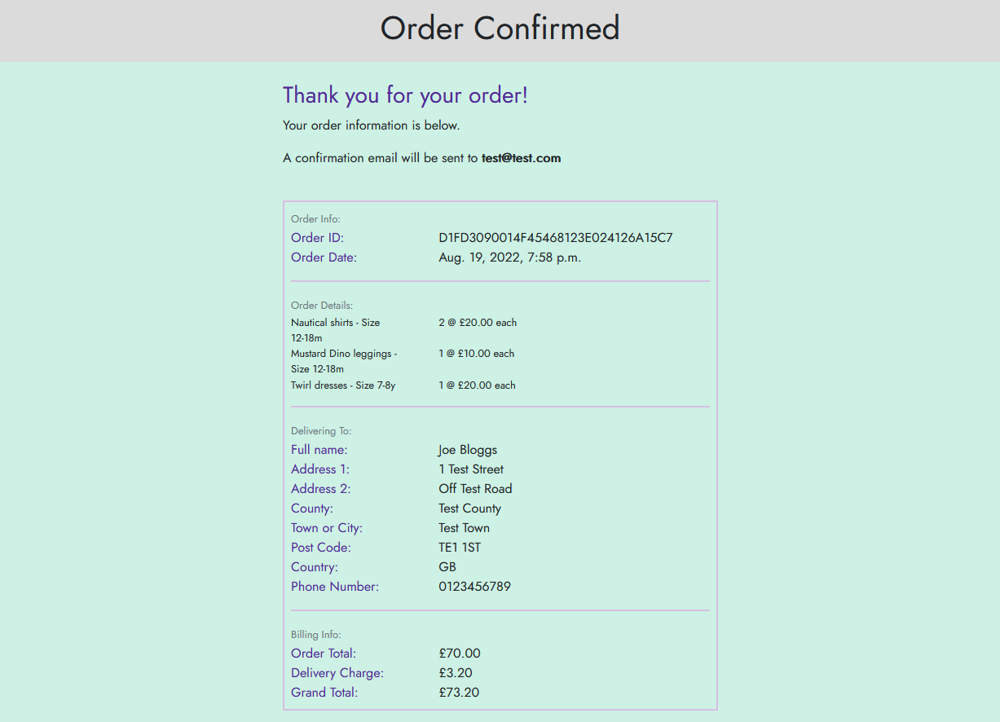
- They are also sent the same details in a confirmation email.
## Account Profile Page
- When authenticated on the site, the user can view the "Your Profile" page.
- This page allows the user to view and update their contact and delivery details:  

- They will also see a list of their previous orders:  

- The Order Number on each order can be clicked to see more details on the order:  
  
## Newsletter Signup
- The site features a page that allows a visitor to opt in to receiving a newsletter from the site.
- This is a simple form that saves their details into the database, which can be accessed for a mailing list when the newsletter is sent.  

- After completing the form, a notification banner shows the user that the sign up was successful.  
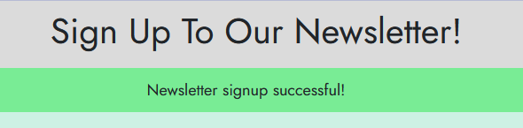
## Footer
- At the bottom of each page is a consistent footer, presenting the user with contact details for the site owner, as well as their social media links.  

## Miscellaneous
- Email obfuscation - email addresses displayed on the site are protected from scraping by bots, but are still interactive for humans.  

# Testing
Sign up
sign in
Can view authenticated areas
sign out
Can't view authenticated areas
Add to basket
Add multiple to basket
Delete from basket
Go to checkout
No details filled on first purchase
Form validation
Complete checkout
Card validation
Email received
Save details viewable in profile
Edit details in profile
Admin can create events
Non admin but authenticated can't create events.
Admin can delete events
Events in the past not shown
Non authenticated user can't create requests
Authenticated user can create requests
Authenticated user can see own requests and not others
User can delete and ammend own requests.
Newsletter signup saves in DB
Admin can add, update and remove products.
Product filters work.
No products on filters shows helpful page.
## Validation
- [HTML Validation](https://validator.w3.org)
  - No validation issues were found:
    - Note only pages / content on pages that do not require user authentication could be checked.
    - This means the checkout, order confirmation and forms (such as on the request page) have not been validated.
    - Given the standards adhered to for all content resulting in the tests below not generating any errors, it is not expected that any areas of the site that require authentication would fail validation.
  - [Homepage](./docs/assets/validation/html_homepage.png)
  - [Products Page](./docs/assets/validation/html_products.png)
  - [Product Details](./docs/assets/validation/html_product_details.png)
  - [Basket](./docs/assets/validation/html_basket.png)
  - [Request Page](./docs/assets/validation/html_request.png)
  - [Events Page](./docs/assets/validation/html_events.png)
  - [Newsletter Signup](./docs/assets/validation/html_newsletter.png)
  - [Account Signup](./docs/assets/validation/html_account_signup.png)
- [CSS Validation](https://jigsaw.w3.org/css-validator/validator?uri=https%3A%2F%2Fres.cloudinary.com%2Fho64hklak%2Fraw%2Fupload%2Fv1%2Fstatic%2Fcss%2Fbase.672087c91bc2.css&profile=css3svg&usermedium=all&warning=1&vextwarning=&lang=en)
  - No validation issues were found.
    - Note that the report contains warnings regarding the use of CSS variables, as the validator does not check these.
  - [CSS](./docs/assets/validation/css.png)
- Lighthouse scores:
  - Homepage:  
  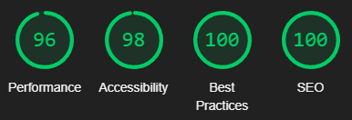
  - Products Page:  
  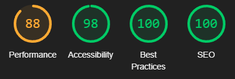
    - Performance could be improved by saving images in a more optimised format with better compression.
  - Product Details:  
  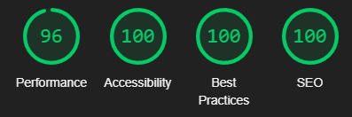
  - Events Page:  
  
  - FAQ Page:  
  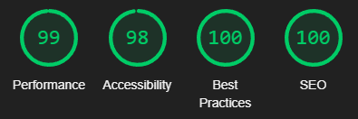
  - Shopping Basket:  
  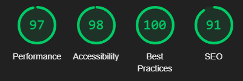
  - Checkout Page:  
  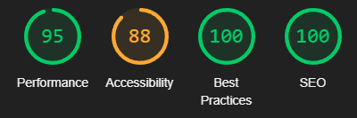
    - Accessibility is not as high as it could be as form elements are missing labels. However this is because the form is using a custom Crispy forms layout, and Crispy forms is not associating the labels in the first column with the input fields.
  - Order Confirmation:  
  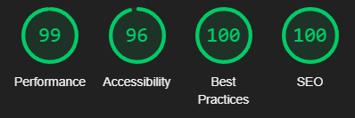
  - Account Profile Page:  
  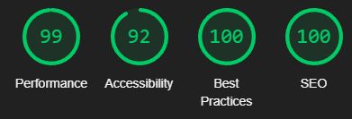

# Deployment
## Prerequisites
- A [Stripe](https://www.stripe.com) account
  - Note the Stripe public and secret keys for your account.
- A [GMail](https://www.gmail.com) account to send emails from the site.
  - Create an App Password for the account and note this.
## To Run The Project Locally:
- Clone the GitHub repository:
  - Open a terminal to the location you wish to save the project in.
  - Run `git clone https://github.com/SiJiL82/ecommerce-site.git`
- Create a [Cloudinary](https://www.cloudinary.com) account
  - Copy the API Environment Variable (`CLOUDINARY_URL=cloudinary://xxxxxxx`)
- Inside the repository create a `.env` file with the following contents:
  - `CLOUDINARY_URL` - API Environment Variable from Cloudinary.
  - `DATABASE_URL` - Postgres URI.
  - `HEROKU_APP_NAME` - The name of your Heroku app.
  - `SECRET_KEY` - Generate a random secret key value.
  - `EMAIL_HOST_PASS` - App password from your GMail account.
  - `EMAIL_HOST_USER` - GMail account email address.
  - `STRIPE_PUBLIC_KEY` - Public Key from your Stripe account.
  - `STRIPE_SECRET_KEY` - Secret Key from your Stripe account.
  - `STRIPE_WH_SECRET` - Webhook Secret from your Stripe Webhook Endpoint.
- Install dependencies:
  - Install Python and PIP
  - Run `pip install -r requirements.txt`
- Run the webserver:
  - `python3 manage.py runserver`
## To Deploy The Project To Heroku:
- Clone the GitHub repository:
  - Open a terminal to the location you wish to save the project in.
  - Run `git clone https://github.com/SiJiL82/ecommerce-site.git`
- Create your own GitHub repository to host the project.
- Run `git remote set-url origin <Your GitHub Repo Path>` to set the remote repository location to your own repository.
- Push the files to your repository with `git push`
- Create a [Heroku](https://heroku.com) account.
- Create a new Heroku application.
- Go to the Deploy tab of the application.
  - Link your GitHub account.
  - Connect the application to the repository you created.
- Go to the Resources tab.
  - Click Find More Addons and add:
    - Cloudinary
      - Open Cloudinary from the resource it created and copy the API Environment Variable (`CLOUDINARY_URL=cloudinary://xxxxxxx`)
    - Heroku Postgres
      - Open the Postgres details from the resource, go to the Settings tab, and view the Database Credentials.
        - Copy the URI (`postgres://xxxxxxx`)
- Log in to your Stripe account, and add your Heroku app URL as a Webhook endpoint.
  - Copy the Webhook Secret (`whsec_xxxxxx`)
- Go to the Settings tab.
  - Click "Reveal Config Vars" and add the following entries:
    - `CLOUDINARY_URL` - API Environment Variable from Cloudinary.
    - `DATABASE_URL` - Postgres URI.
    - `HEROKU_APP_NAME` - The name of your Heroku app.
    - `SECRET_KEY` - Generate a random secret key value.
    - `EMAIL_HOST_PASS` - App password from your GMail account.
    - `EMAIL_HOST_USER` - GMail account email address.
    - `STRIPE_PUBLIC_KEY` - Public Key from your Stripe account.
    - `STRIPE_SECRET_KEY` - Secret Key from your Stripe account.
    - `STRIPE_WH_SECRET` - Webhook Secret from your Stripe Webhook Endpoint.
- Go back to the Deploy tab.
  - Click "Deploy Branch"
  - Monitor the build logs for completion of the deployment.
- Click "Open app" to launch the site.

# Known Bugs
Presently there are no known bugs with the site.
# Future Developments
- Customise the AllAuth account management forms (sign up, sign in etc.) so they fit the site style. 
- Add order completion for the site owner to mark an item as shipped and send the customer an email.
- Add product search to the site as it grows to a number of products that warrants it.
- Stock Management - as the site sells bespoke products, it is likely that only a limited number of products will be ready made and available to buy immediately. The roadmap for this area of the site will allow the site owner to enter how many of an item are available to purchase, and automatically subtract items from this when a customer orders them. Once all stock has been purchased, the site will convert the product into a "request order" status.
# Credits
- Inspiration for the site design and theme colours taken from the [Mini Sew N Sew](https://www.minisewnsew.com/) website that this project will be replacing. However no code/modules etc. were taken from the site - this project was written from scratch just using the site themes and existing product imagery and text to populate the site.
- [Django Email Obfuscator](https://github.com/morninj/django-email-obfuscator) - used to obfuscate sensitive links such as emails and telephone numbers
- [XML Sitemaps](https://www.xml-sitemaps.com/) - sitemap.xml generated with this tool.