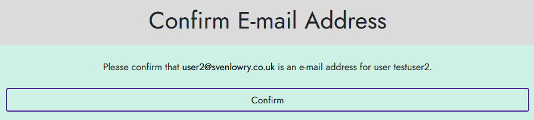
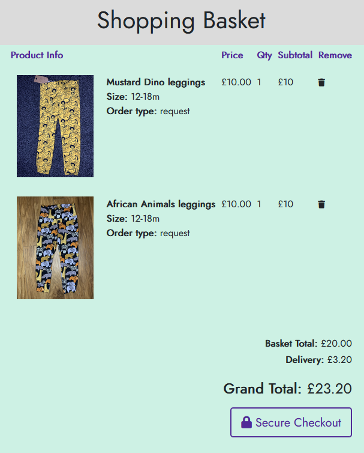
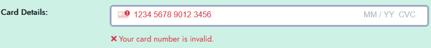

# Site Testing <!-- omit in toc -->
# Table of Contents <!-- omit in toc -->
- [Authentication](#authentication)
  - [Account Sign Up](#account-sign-up)
  - [Account Sign In](#account-sign-in)
  - [Protected Site Pages](#protected-site-pages)
  - [Account Sign Out](#account-sign-out)
  - [Profile](#profile)
- [Purchase Journey](#purchase-journey)
  - [Basket](#basket)
  - [Checkout](#checkout)
- [Products](#products)
  - [Product Admin](#product-admin)
  - [Product Category Filters](#product-category-filters)
- [Events](#events)
  - [Event Admin](#event-admin)
- [Requests](#requests)
  - [Request Management](#request-management)
## Authentication
### Account Sign Up
- Attempting to sign up with an email address already in use by another user results in an error:  

- Entering mismatched email addresses in the sign up form results in an error:  
  
- Entering a user name that includes invalid characters shows an error:  
  
- Entering a weak password (such as `password`) shows an error:  

- Entering mismatched passwords shows an error:  

- Filling in the form with valid details successfully creates an account and sends a verification email:  
  
  
  
- Attempting to log in without verifying email address fails:
  - The same email verification page is shown to the user as was originally shown when they created the account.
- Clicking the verify link in the email successfully verifies the account and allows the user to log in:  
  
  
### Account Sign In
- Attempting to sign in with an invalid email address shows an error:  
  
- Attempting to sign in with a valid email address but invalid password shows an error:  
  
- Signing in with valid credentials successfully logs the user into the site:  
  
### Protected Site Pages
- When signed in as an authenticated user, protected areas of the site are accessible:  
  - My Profile:  
  
  
  - Request Page:  
  
- When signed out, protected areas of the site are no longer accessible:  
  - My Profile:  
  
  - Attempting to access `/profile/` redirects to the Sign In page:  
  
  - Request Page:
  
- When signed in as a regular user, the `/admin/` areas of the site are not accessible:  
  
- When signed in as a site administrator, the "add event" form is visible on the Markets page:  
  
- When signed in as a user that is not a site administrator, the "add event" form is not visible on the Markets page:  
  
### Account Sign Out
- The user can easily sign out of the site using the account menu:  
  
  
  
### Profile
- Entering details into the profile page saves those details:  
  - New profile, no details are saved:  
  
  - Entering details and clicking the form button saves the details, which are then loaded into the form on subsequent viewing:    
  
  
- Going to a purchase checkout auto completes the checkout form with these details:  
  
- Changing the details during the checkout process updates in the profile page when the save button is ticked:  
  
  
## Purchase Journey
### Basket
- Products can be added to and removed from the basket: 
  - The basket total and grand total update accordingly when items are added and removed.  
  
  
  
- Multiple identical items can be added to the basket and the quantity increases:  
  
- Multiple items of the same type but different sizes can be added to the basket but do not combine:  
  
- Removing all items from the basket shows the user that the basket is empty:  
  
### Checkout
- Not entering a required field on the details form shows an error:  
  
- Entering an invalid card number shows an error:  
  
- Not entering all fields on the card details shows an error:  
  
  
  
- Entering all fields on the form correctly successfully places an order:  
  
- An order confirmation email is sent to the user when an order is successfully placed:  
  
- If the order is placed as a signed in user, the order is now visible in the user's profile page:  
  
## Products
### Product Admin
- The site owner can use the CMS admin pages to add a new product:  
  
- The new product shows up on All Products, and under the category for the product:  
  
  
- The product details page is created for the new product:  
  
- The site owner can use the CMS admin pages to update a product:  
  
  
  
- The site owner can use the CMS admin pages to delete a product:  
  
  
- A deleted product no longer shows up in the product listing: 
  - Note: the product category was changed to "Dresses" in the test above, hence this screenshot showing the Dresses category, not Jumpers that the product was initially added to.
  
- A deleted product details page is no longer accessible:  
  
### Product Category Filters
- Products appear in the correct category filter in the shop:  
  - For example, a pair of dungarees only show in the Dungarees filter, but do not show in Jumpers.
  
  
- All products appear on the all products page, regardless of category:  
  
  
- When no products are available for a specific category, the category filter shows an information message to the user:  
  
## Events
### Event Admin
- The site owner can create a new event from the events page, rather than needing to use the CMS admin page:  
  
  
- Not entering any required fields on the add event form shows an error:  

- The site owner can delete an event using the UI element on each event:  
  
  
- This UI element is only visible when logged in as an administrator. Regular users cannot see it:  
  
- Events created in the past / events that pass their event date are not shown on the page:  
  
  
## Requests
### Request Management
- Authenticated 

Authenticated user can create requests
Authenticated user can see own requests and not others
User can delete and amend own requests.
Newsletter signup saves in DB
